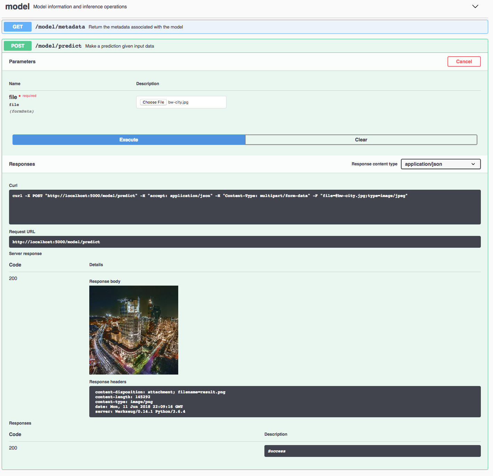

[](https://travis-ci.com/github/IBM/MAX-Image-Colorizer) [](http://max-image-colorizer.codait-prod-41208c73af8fca213512856c7a09db52-0000.us-east.containers.appdomain.cloud)

[](http://ibm.biz/max-to-ibm-cloud-tutorial)

# IBM Code Model Asset Exchange: Image Translation (Grayscale to Color)

This repository contains code to instantiate and deploy an image translation model. This model is a Generative Adversarial Network (GAN) that was trained by the [IBM CODAIT Team](http://codait.org) on [COCO dataset](http://mscoco.org/) images converted to grayscale and produces colored images. The input to the model is a grayscale image (jpeg or png), and the output is a colored 256 by 256 image (increased resolution will be added in future releases).

The model is based on Christopher Hesse's [Tensorflow implementation of the pix2pix model](https://github.com/affinelayer/pix2pix-tensorflow). The model files are hosted on [IBM Cloud Object Storage](https://max-cdn.cdn.appdomain.cloud/max-image-colorizer/1.0.0/assets.tar.gz). The code in this repository deploys the model as a web service in a Docker container. This repository was developed as part of the [IBM Code Model Asset Exchange](https://developer.ibm.com/code/exchanges/models/) and the public API is powered by [IBM Cloud](https://ibm.biz/Bdz2XM).

## Model Metadata
| Domain | Application | Industry  | Framework | Training Data | Input Data Format |
| ------------- | --------  | -------- | --------- | --------- | -------------- |
| Vision | Image Coloring | General | TensorFlow | [COCO Dataset](http://mscoco.org/) | JPEG or PNG Image |

## References
* _J. Isola, J. Zhu, T. Zhou, A. Efros_, ["Image-to-Image Translation with Conditional Adversarial Networks"](https://arxiv.org/abs/1611.07004), CVPR 2017
* [pix2pix TensorFlow GitHub Repository](https://github.com/affinelayer/pix2pix-tensorflow)


## Licenses

| Component | License | Link  |
| ------------- | --------  | -------- |
| This repository | [Apache 2.0](https://www.apache.org/licenses/LICENSE-2.0) | [LICENSE](LICENSE) |
| Model Code (3rd party) | [MIT](https://opensource.org/licenses/MIT) | [TensorFlow pix2pix Repository](https://github.com/affinelayer/pix2pix-tensorflow/blob/master/LICENSE.txt) |
| Model Weights | [Apache 2.0](https://www.apache.org/licenses/LICENSE-2.0) | [LICENSE](LICENSE)
| Test Assets | [CC0 License](https://creativecommons.org/publicdomain/zero/1.0/) | [Asset README](samples/README.md)

## Pre-requisites:

* `docker`: The [Docker](https://www.docker.com/) command-line interface. Follow the [installation instructions](https://docs.docker.com/install/) for your system.
* The minimum recommended resources for this model is 2GB Memory and 2 CPUs.

# Deployment options

* [Deploy from Docker Hub](#deploy-from-docker-hub)
* [Deploy on Red Hat OpenShift](#deploy-on-red-hat-openshift)
* [Deploy on Kubernetes](#deploy-on-kubernetes)
* [Run Locally](#run-locally)

## Deploy from Docker Hub

To run the docker image, which automatically starts the model serving API, run:

```
$ docker run -it -p 5000:5000 quay.io/codait/max-image-colorizer
```

This will pull a pre-built image from Docker Hub (or use an existing image if already cached locally) and run it.
If you'd rather checkout and build the model locally you can follow the [run locally](#run-locally) steps below.

## Deploy on Red Hat OpenShift

You can deploy the model-serving microservice on Red Hat OpenShift by following the instructions for the OpenShift web console or the OpenShift Container Platform CLI [in this tutorial](https://developer.ibm.com/tutorials/deploy-a-model-asset-exchange-microservice-on-red-hat-openshift/), specifying `quay.io/codait/max-image-colorizer` as the image name.

## Deploy on Kubernetes

You can also deploy the model on Kubernetes using the latest docker image on Docker Hub.

On your Kubernetes cluster, run the following commands:

```
$ kubectl apply -f https://raw.githubusercontent.com/IBM/MAX-Image-Colorizer/master/max-image-colorizer.yaml
```

The model will be available internally at port `5000`, but can also be accessed externally through the `NodePort`.

A more elaborate tutorial on how to deploy this MAX model to production on [IBM Cloud](https://ibm.biz/Bdz2XM) can be found [here](http://ibm.biz/max-to-ibm-cloud-tutorial).

## Run Locally

1. [Build the Model](#1-build-the-model)
2. [Deploy the Model](#2-deploy-the-model)
3. [Use the Model](#3-use-the-model)
4. [Development](#4-development)
5. [Cleanup](#5-cleanup)


### 1. Build the Model

Clone this repository locally. In a terminal, run the following command:

```
git clone https://github.com/IBM/MAX-Image-Colorizer.git
```

Change directory into the repository base folder:

```
cd MAX-Image-Colorizer
```

To build the docker image locally, run:

```
docker build -t max-image-colorizer .
```

All required model assets will be downloaded during the build process. _Note_ that currently this docker image is CPU only (we will add support for GPU images later).

### 2. Deploy the Model

To run the docker image, which automatically starts the model serving API, run:

```
docker run -it -p 5000:5000 max-image-colorizer
```

### 3. Use the Model

The API server automatically generates an interactive Swagger documentation page. Go to `http://localhost:5000` to load it. From there you can explore the API and also create test requests.

Use the `model/predict` endpoint to load a test grayscale image (you can use one of the test images from the `assets` folder) and get a colored image.




You can also test it on the command line, for example:

```
curl -F "image=@samples/bw-city.jpg" -XPOST http://localhost:5000/model/predict > result.png
```


### 4. Development

To run the Flask API app in debug mode, edit `config.py` to set `DEBUG = True` under the application settings. You will then need to rebuild the docker image (see [step 1](#1-build-the-model)).


### 5. Cleanup

To stop the docker container type `CTRL` + `C` in your terminal.

## Resources and Contributions
   
If you are interested in contributing to the Model Asset Exchange project or have any queries, please follow the instructions [here](https://github.com/CODAIT/max-central-repo).
